# A privacy-preserving framework integrating federated learning and transfer learning for wind power forecasting

Yugui Tang a, Shujing Zhang b, Zhen Zhang a, \*

a School of Mechatronic Engineering and Automation, Shanghai University, Shanghai, 200444, China ie

# ARTICLEINFO

# ABSTRACT

Handling Editor: Jesse L. The

Keywords:   
Privacy-preserving   
Federated learning   
Personalized transfer learning   
Fine-tuning

Data-drive approaches show gifiant potential in accurately foeastinghe power eneration wiur-HT as a solution  dress eue mitddat yleveragi at fom ther turbine. However econvenal cnralizra prac raise cn about dat privy isks. In thi study, we proos privacy-preservingframework that incorporates federated learning andtranser learning or wind power forecasting. Firstly, we desgn a hybrid model with a serie architecture as the backbone model to improve forecscraySeony, tepropoostagorcns federaears pre-i and personalized fne-tuning. The federated learning stage pre-trains a knowledge-sharing model without disclosing raw data from source domains. Based on the pre-trained global model, personalized fine-tuning is apl t etablis a ustomiz model o he tart turbine.Expermental esul demonstrat hat e po pos hybrid model achieves betterforecasting accuracy. Additionally, the two-stage framework notonly addresss insufficient data while considering privacy presrvation but also enhances personalized adaptation shard nowledge for the target turbine.Compared to localtrainng and taditional ederated learig, the proposed framework demonstrates obvious accuracy improvements, reaching up to $4 3 . 3 2 \ \%$ and $2 7 . 9 4 \ \%$ respectively.

# . Introduction

Wind power has emerged as a highly sought-after alternative to fossil fuels due to its cost-effectiveness, abundance, and eco-friendliness [1]. However, the inherent randomness, intermittency, and uncertainty of wind power present significant challenges in integrating it into the grid. Therefore, accurate wind power forecasting plays a pivotal role in enhancing the reliability of system operations [2]. Generally, these approaches can be categorized into physical approaches and data-driven approaches.

Physical approaches focus on establishing mathematical expressions between power output and meteorological conditions, then obtaining the forecasting power output by Kalman filter [3]. These approaches utilize physical relationships instead of historical data to forecast power generation, making them suitable for providing a rough estimation of regional energy capacity. Data-driven approaches can be further divided into statistical methods and machine learning methods. Treating power generation as a time-varying signal, autoregressive integrated moving average (ARIMA), one of the typical statistical methods, has been developed for wind power forecasting [4]. However, statistical methods primarily concentrate on historical power data, often ignoring the impact of meteorological factors. With the mass deployment of artificial intelligence in energy fields, machine learning methods, which excel in handling multivariate inputs, have drawn wide attention in academics. Neural network structures [5,6] and regressive architectures [7] have demonstrated non-linear learning capabilities in establishing correlations between wind power and meteorological factors. Besides, convolution neural network (CNN) [8,9], long short-term memory (LSTM) [10,11], temporal convolutional network (TCN) [12,13], and their variants combining with attention mechanism [1416] have been introduced to address gradient disappearance or explosion when dealing with complex tasks. Later, data decomposition techniques such as wavelet transform [1719] and variational model decomposition [20, 21], have been employed as pre-processing steps to decompose original power curves into some sub-components, effectively addressing issues related to randomness and instability [22]. Heuristic optimization algorithms, including dragonfly algorithm [23] and grey wolf optimization [24], have been used to optimize the hyperparameters of machine learning models [25].

Data-driven approaches, as described above, mainly center around constructing forecasting models with sufficient data. However, these approaches are not well-suited for few-shot modeling in wind power forecasting. Recent studies have introduced transfer learning as a promising solution to mitigate the reliance on extensive training data for wind power forecasting [26]. Liu et al. applied fine-tuning techniques to leverage source domain knowledge to address data shortage, in which involves pre-training a model on source domain turbines and fine-tuning parameters using limited data from the target turbine [27]. Similarly, a multi-layer perceptron model was integrated with the fine-tuning strategy to facilitate knowledge transfer in wind power forecasting [28]. Based on extreme learning machine (ELM) model, Liu et al. integrated joint distribution adaptation into a fine-tuning framework, which explores temporal variation characteristics between historical and current moments, then updates the pre-trained ELM model [29]. Recently, to further reduce the reliance on source domain data, a multi-task learning framework was proposed for modeling of a newly built wind turbine cluster [30]. While the above techniques have shown promise in addressing few-shot modeling in wind power forecasting, they follow a centralized training strategy wherein all data is aggregated within the same client for model training. This training strategy assumes that all data originating from other turbines is non-sensitive and poses no threat to user privacy. However, data sharing between wind turbines could potentially give rise to business risks in engineering applications, such as technical privacy disclosure.

Therefore, this study aims to address insufficient training data in privacy-preserving scenarios. Specifically, this paper proposes a privacypreserving framework incorporating federated learning and transfer learning to facilitate knowledge-sharing and knowledge-transferring in wind power forecasting. Firstly, a forecasting model following series architecture, namely Temporal convolution - Gated recurrent unit Network (TGN), is applied [31]. Secondly, based on the hybrid model, the proposed two-stage framework can be divided into federated learning-based pre-training and personalized transfer learning. The federated learning is responsible for implementing knowledge-sharing of source domain turbines without compromising data privacy, and the personalized transfer learning is responsible for transferring the shared knowledge and adjusting it to fit the target turbine by means of fine-tuning. The proposed framework not only provides a knowledge-sharing solution considering privacy preservation, but also achieves personalized adaptation of shared knowledge on the target turbine. The main contributions of this study are elaborated in detail as follows:

(1) As the backbone model of the proposed two-stage framework, the TGN follows a series architecture that is composed of a TCN module and GRU module. The TCN module extracts regional temporal patterns along the temporal direction, then the GRU module further captures the time dependencies between temporal patterns, presenting better forecasting accuracy than traditional deep learning models.   
(2) In the proposed two-stage framework, federated learning is introduced into the pre-training stage to extract the knowledge shared across source domain turbines. By replacing transmitting raw data with submitting gradient updates, federated learningbased pre-training not only ensures the data privacy of sensitive power data but also improves computational efficiency. Then fine-tuning is applied to update the pre-trained global model to personalized fit the target turbine.   
(3) The TGN model and two-stage framework are validated using actual datasets. The TGN exhibits superior forecasting performance compared to other benchmark models. Furthermore, the proposed framework significantly enhances forecasting accuracy

for the target turbine while also taking data privacy into consideration.

The remaining part of this work proceeds as follows: Section 2 provides an introduction to related works of this study. In Section 3, a comprehensive explanation of the proposed model and two-stage forecasting framework is presented. The experiments and discussions used to evaluate details of the proposed study are illustrated in Section 4. Lastly, Section 5 encapsulates the findings and offers concluding remarks.

# 2.Related work

In this section, related works involved in the proposed forecasting framework are introduced in detail, including transfer learning and federated learning.

For machine learning models, attaining satisfactory forecasting accuracy requires a substantial amount of training data. However, collecting sufficient data and training models from scratch are timeconsuming processes, particularly in cases such as a newly built power site [32] or wind turbine clusters within a newly developed wind farm [30]. In these instances, there is insufficient data available to train a stable forecasting model for the target site. To handle these few-shot learning tasks, transfer learning techniques, a knowledge-transferring paradigm aiming at leveraging related knowledge from other tasks, have been developed in the power forecasting field. One of the typical transfer learning techniques is fine-tuning strategy [32]. It involves initially developing a pre-trained model on a source domain to obtain transferable knowledge, followed by fine-tuning the pre-trained parameters based on the target tasks. Besides, multi-task learning technique leverages collaborative relationships between tasks to mitigate data scarcity in target tasks [30]. However, it is worth noting that these techniques follow the centralized training strategy, which requires a central organization to aggregate all training data. The centralized training may pose significant security concerns in scenarios where data privacy is paramount. Therefore, the central organization must carefully consider the potential risks associated with the exposure of sensitive information, especially when collecting and storing data.

To address the above issue of data privacy in knowledge transfer, federated learning, a decentralized machine learning paradigm, has been developed in privacy-preservation cases [33]. In federated learning, a central server coordinates with multiple local clients for distributed training. Specifically, local clients train local models using their own data individually, without transmitting raw data to each other. Instead, these local clients submit model updates, not the original data, to the central server. The central server aggregates and averages these updates from local clients to train a global model that has the same architecture as the local model. The iterative communication process continues until the global model converges to a stable level. The global model can extract shared knowledge between multiple clients while meeting privacy protection. Federated learning, with its distributed architecture, has found application in various fields. For example, Li et al. integrated the deep reinforcement learning approach into a federated learning framework for wind power forecasting [34]. Moayyed et al. proposed a CNN-based federated learning framework to address insufficient data in solar forecasting [35] and wind power forecasting [36], respectively. Besides, transfer learning techniques have also been combined with federated learning to tackle data distribution differences between related tasks. For instance, Wang et al. incorporated a domain discriminator into the federated learning framework to achieve domain alignment in the field of fault detection [37]. Similarly, adversarial learning has been introduced into the federated learning framework to obtain a more stable model for natural gas demand forecasting [38]. However, the purpose of the above approaches is to approximate an optimal global model for all clients without compromising data privacy, but ignoring the personalization for specific clients. It may lead to performance degradation on certain clients, especially for clients with intrinsic data heterogeneity.

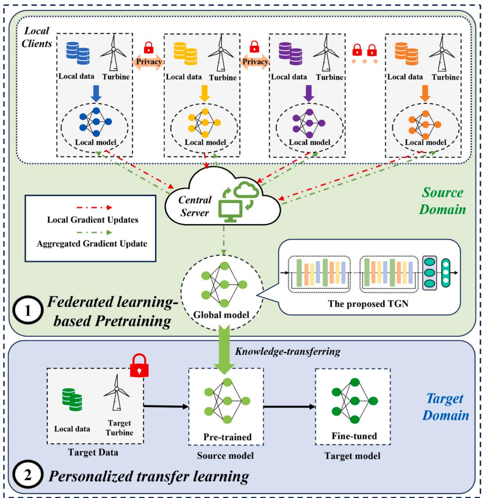

Therefore, this paper provides an exploration of wind power forecasting by integrating federated learning and transfer learning. The objective is to further improve the forecasting accuracy of the traditional federated learning approach. In the proposed framework, federated learning is responsible for obtaining a pre-trained global model from privacy-preserving scenarios. It leverages distributed computational and storage resources to collaboratively train the model without transmitting sensitive raw data. Additionally, an independent transfer learning step is responsible for addressing the personalization for specific wind turbines. It avoids performance degradation caused by data heterogeneity and ensures that the trained model performs optimally on the target turbine.

# 3. Method

In this section, the proposed federated learning transfer learning framework is introduced in detail, including problem formulation,

framework architecture, and training strategy.

# 3.1. Problem formulation

Wind power generation is intricately linked to various wind conditions, encompassing factors such as wind speed, turbulence intensity, and wind shear. Specifically, wind power presents a positive correlation with wind speed. Turbulence intensity serves as a descriptor for air motion, detailing the relative intensity of fluctuating wind speeds. Wind shear is a variable influenced by topography, regional surface roughness, and atmospheric stability. Its effects extend to fluctuations in wind power output, as it impacts the absorption of wind energy. As a result, the framework proposed in this study aims to forecast wind power generation while considering both wind conditions and historical power data.

Given a set of wind conditions represented as $\left( \mathbf { x } ^ { 1 } , \mathbf { x } ^ { 2 } , . . . , \mathbf { x } ^ { C } \right) ^ { \top } = \left( \mathbf { x } _ { 1 } , \right.$ $\mathbf { x } _ { 2 } , . . . , \mathbf { x } _ { T } ) \in \mathbb { R } ^ { C \times T }$ ,where $\mathbf { x } _ { t } = \left( x _ { t } ^ { 1 } , x _ { t } ^ { 2 } , . . . , x _ { t } ^ { C } \right) ^ { \top } \in \mathbb { R } ^ { C }$ signifies a vector consisting of $C$ wind conditions at time t and $\mathbf { x } ^ { k } = \left( x _ { 1 } ^ { k } , x _ { 2 } ^ { k } , . . . , x _ { T } ^ { k } \right) ^ { \top } \in \mathbb { R } ^ { T }$ represents the $k ^ { t h }$ wind condition over a window with $T$ time-steps. The input $X$ of the proposed framework incorporates historical wind power $( y _ { 1 } , y _ { 2 } , . . . , y _ { T } )$ along with the past and forecasted wind conditions $( { \bf x } _ { 1 + h }$ $\mathbf { x } _ { 2 + h } , . . . , \mathbf { x } _ { T + h } )$ to predict future power generations, where $h$ denotes the forecasting horizon. The mathematical representation can be expressed by:

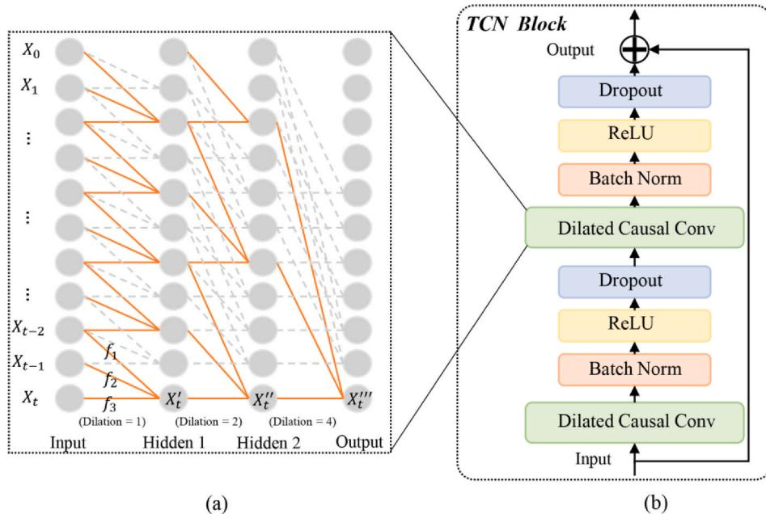  
ig. 2. The architecture of TCN module. (a) Dilated causal convolution (b) The TCN blocl

$$
\left( \widehat { y } _ { T + 1 } , \widehat { y } _ { T + 2 } , . . . , \widehat { y } _ { T + h } \right) = \psi ( X ) = \psi ( \mathbf { x } _ { 1 + h } , . . . , \mathbf { x } _ { T + h } ; y _ { 1 } , y _ { 2 } , . . . , y _ { T } )
$$

# 3.2. Overview

Based on the above mathematical representation, a two-stage forecasting framework incorporating federated learning and transfer learning is proposed for privacy-preserving knowledge sharing in wind power forecasting. Fig. 1 presents an overview of the proposed framework, which can be divided into three parts: the hybrid model combining temporal convolution network (TCN) and gated recurrent unit (GRU), namely TGN, the federated learning-based pre-training considering privacy protection, and the personalized transfer learning using fine-tuning strategy. Specially, the TGN model follows the series architecture to capture regional spatial features and temporal dependence, respectively. In the pre-training stage, federated learning is introduced to deal with insufficient training data and data privacy. The local TGN models trained in local clients only provide their gradient updates instead of original data to update the global model. Then the global TGN model acts as the pre-trained model to join in the personalized learning stage. The pre-trained global model is finetuned to implement personalized adaptation by referring to the data from the target turbine. The proposed framework not only overcomes insufficient training data in privacy-preserving scenarios, but also addresses the personalization of traditional federated learning.

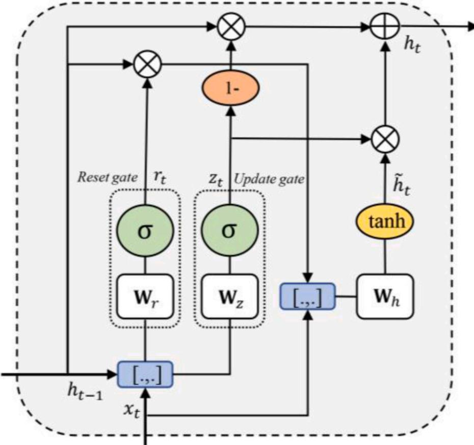  
Fig. 3. The architecture of GRU.

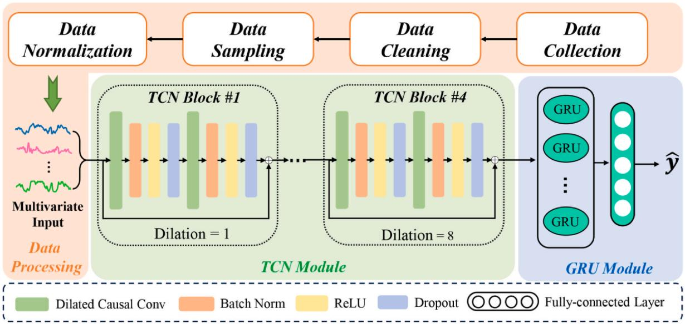  
Fig. 4. The proposed TGN model incorporating TCN module and GRU module.

# 3.3. TGN model

The TGN model is the backbone of the proposed forecasting framework, whose purpose is to reach a higher forecasting accuracy using the given training data. The TGN model can be divided into the TCN module and the GRU module.

TCN technique is composed of three parts: causal convolutions, dilated convolutions, and residual connections. In causal convolutions, the current output is only affected by historical and current inputs. Fig. 2 (a) presents the internal architecture of causal convolutions. Suppose the input data are $\pmb { X } = ( X _ { 1 } , X _ { 2 } , . . . , X _ { t } )$ , the last three input nodes are $X _ { t - 2 } , X _ { t - 1 }$ $X _ { t }$ , and the convolution kernel is denoted as $( f _ { 1 } , f _ { 2 } , f _ { 3 } )$ , the output of first hidden layer at $t$ is represented as:

$$
X _ { t } ^ { ' } = f _ { 1 } \bullet X _ { t - 2 } + f _ { 2 } \bullet X _ { t - 1 } + f _ { 3 } \bullet X _ { t }
$$

In the causal convolutions, only the inputs at the current and previous timepoints are convoluted with convolution kernels, avoiding the leakage from the past to the future [39]. Besides, the TCN structure replaces the simple convolutions with dilated convolutions, as shown in Fig. 2(a). Specifically, the dilated convolution is applied to inputs with definite gaps $d$ in the kernels, whose output can be given as:

$$
H ( t ) = \sum _ { i = 0 } ^ { n - 1 } f _ { ( i ) } \bullet X _ { t - d \bullet i }
$$

in which $n$ is the convolution kernel size and $t - d \bullet i$ accounts for the direction of the convolution. The receptive fields of dilated convolutions grow exponentially with the depth of the network, especially when dilation size d grows exponentially. The longer receptive fields of dilated convolutions reduce computational burden and the risk of over-fitting.

Residual connections are introduced to overcome the gradient vanishing of a deep network. As shown in Fig. 2(b), a TCN block with residual connections is composed of dilated causal convolution layers, batch normalization layers, rectified linear unit (ReLU) activation functions, and dropout layers. For one TCN block, its output contains the output of activation function and the input of the current block, ensuring feature information can be passed steadily without gradient vanishing.

As shown in Fig. 2(a), the output layer of TCN module can be denoted as $( X _ { 1 } ^ { ' \prime } , X _ { 2 } ^ { ' \prime } , . . . , X _ { t } ^ { ' \prime } )$ , which reflects the regional temporal patterns of input data. Obviously, there are time dependencies between the output of TCN module at different timepoints. Therefore, the GRU technique is applied to further capture temporal correlations between $( X _ { 1 } ^ { ' \prime } , X _ { 2 } ^ { ' \prime } , . . . , X _ { t } ^ { ' \prime } )$ GRU, one of the variants of LSTM structure, utilizes the reset gate and update gate to copy with long-term temporal dependence, as shown in Fig. 3. The reset gate determines whether to combine the input with previous hidden information. The update gate defines the proportion of previous information saved to the current timepoint. The simplified gates allow the GRU structure to have fewer parameters and faster convergence speed while reducing the risk of over-fitting. The mathematical expression of GRU can be given by:

$$
\begin{array} { c } { \mathbf { z } _ { t } = \sigma ( \mathbf { W } _ { \tau } [ \mathbf { h } _ { t - 1 } ; \mathbf { x } _ { t } ] + \mathbf { b } _ { z } ) } \\ { \mathbf { r } _ { t } = \sigma ( \mathbf { W } _ { r } [ \mathbf { h } _ { t - 1 } ; \mathbf { x } _ { t } ] + \mathbf { b } _ { r } ) } \\ { \tilde { \mathbf { h } } _ { t } = \mathrm { t a n h } \big ( \mathbf { W } _ { \tilde { h } } [ \mathbf { r } _ { t } \odot \mathbf { h } _ { t - 1 } ; \mathbf { x } _ { t } ] + \mathbf { b } _ { \tilde { h } } \big ) } \\ { \mathbf { h } _ { t } = \left( 1 - \mathbf { z } _ { t } \right) \odot \mathbf { h } _ { t - 1 } + \mathbf { z } _ { t } \odot \tilde { \mathbf { h } } _ { t } } \end{array}
$$

where $\mathbf { z } _ { t }$ and $\mathbf { r } _ { t }$ denote the update gate and reset gate, respectively. $\mathbf { W } _ { z }$ ${ \mathbf W } _ { r } , { \mathbf W } _ { \tilde { h } } , { \mathbf b } _ { z } , { \mathbf b } _ { r }$ ,and ${ \mathbf b } _ { \tilde { h } }$ are weights and biases to be learned. $\sigma$ is a sigmoid function to activate gates, and $\left[ \mathbf { h } _ { t - 1 } ; \mathbf { x } _ { t } \right]$ represents a concatenation of the previous hidden state $\mathbf { h } _ { t - 1 }$ and current input $\mathbf { X } _ { t }$ .

As shown in Fig. 4, the proposed TGN model follows the series architecture. Specifically, its TCN module is composed of four TCN residual blocks. Dilation sizes of these TCN residual blocks are growing exponentially from 1 to 8. Then the outputs of all temporal convolutions are fed into the subsequent GRU module, whose hidden size is 16. The hidden states of the GRU module are used to form the final feature vector. Finally, a fully-connected layer is responsible for mapping the feature vector into the predicted power. The detailed parameters are listed in Table 1. Besides, the mean square error (MSE) is selected as the loss function to satisfy the forecasting task.

Table 1 The hyper-parameters of the proposed TGN model.   

<table><tr><td>Structure</td><td>Layer</td><td>Input</td><td>Kernel size</td><td>Stride</td><td>Dilation</td><td>Output</td></tr><tr><td>TCN block #1</td><td>Dilated Causal Conv-</td><td>4 × 24</td><td>3</td><td>1</td><td>1</td><td>16 × 24</td></tr><tr><td></td><td>1 Dilated Causal Conv- 2</td><td>16 × 24</td><td>3</td><td>1</td><td>1</td><td>16 × 24</td></tr><tr><td>TCN block #2</td><td>Dilated Causal Conv- 1</td><td>16 × 24</td><td>3</td><td>1</td><td>2</td><td>16 × 24</td></tr><tr><td>TCN block</td><td>Dilated Causal Conv- 2</td><td>16 × 24</td><td>3</td><td>1</td><td>2</td><td>16 × 24</td></tr><tr><td>#3</td><td>Dilated Causal Conv- 1</td><td>16 × 24</td><td>3</td><td>1</td><td>4</td><td>16 × 24</td></tr><tr><td>TCN block</td><td>Dilated Causal Conv- 2</td><td>16 × 24</td><td>3</td><td>1</td><td>4</td><td>16 × 24</td></tr><tr><td>#4</td><td>Dilated Causal Conv- 1</td><td>16 × 24</td><td>3</td><td>1</td><td>8</td><td>16 × 24</td></tr><tr><td></td><td>Dilated Causal Conv-</td><td>16 × 24</td><td>3</td><td>1</td><td>8</td><td>16 × 24</td></tr><tr><td>GRU</td><td>2 GRU layer</td><td>16 ×</td><td></td><td></td><td></td><td></td></tr><tr><td>module</td><td></td><td>24</td><td></td><td></td><td></td><td>1 × 16</td></tr><tr><td></td><td>Fully-</td><td>1 ×</td><td></td><td></td><td></td><td>1 × 1</td></tr></table>

# .4Federated learning-based pre-training

For deep learning models, only models trained by substantial data can reach satisfactory accuracy, but it is hard for new-built turbines to collect enough operation data. By utilizing the prior knowledge from other turbines, transfer learning techniques have been employed to improve the power forecasting performance of target wind turbines in few-shot learning scenarios. However, traditional transfer learning approaches rely on aggregating data from source domain and learning the shared knowledge in a centralized manner, which is not applicable to privacy-preserving sensitive cases. For example, the data sharing of wind turbines belonging to different institutions may raise security concerns regarding technical or commercial information leakage. Meanwhile, transmitting data and centralized training also pose greater challenges to network bandwidth usage and computational resources.

In the proposed two-stage forecasting framework, federated learning is introduced to pre-train a global model without submitting raw data. As one of the distributed learning paradigms, federated learning stores source domain data in multiple local clients rather than the central server, avoiding the risk of privacy leakage and reducing the cost of data transmission. Fig. 5 presents the process of federated learning-based pretraining. Assuming that there are $K$ local clients participating in the federated learning, the pre-training process of each epoch can be divided into five steps:

1) Local training: By locally stored data, the local training process is independently conducted on each individual local client. For local client $k ,$ its gradient information $w _ { t + 1 } ^ { k }$ is calculated based on the MSE loss function.

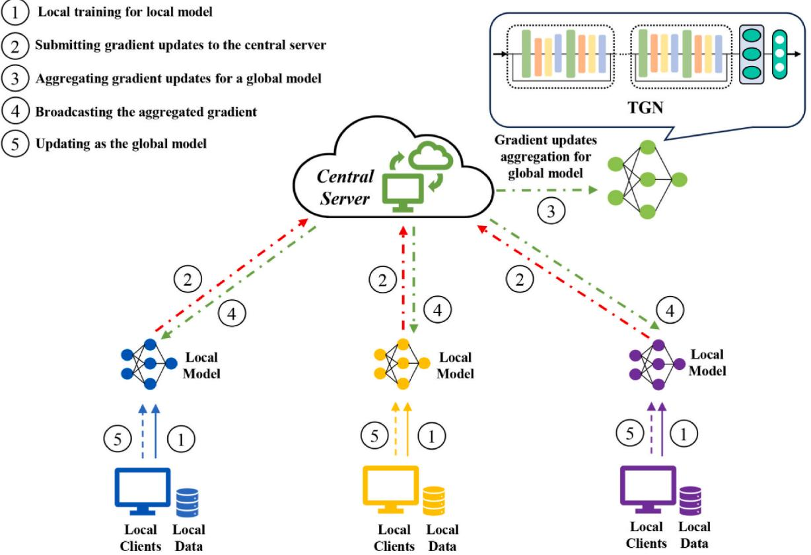  
Fig. 5.The proposed federated learning-based pre-training.

Table 2 The pseudo-code of the proposed federated learning-based pre-training.   

<table><tr><td>Federated learning-based pre-training</td></tr><tr><td>Central Server executes:</td></tr><tr><td>Initialize parameters of the global model w0 and broadcast w0 to all local models</td></tr><tr><td>for each round t= 1, 2, ... do</td></tr><tr><td>for each client k  K in parallel do</td></tr><tr><td>Update local models: +1 ← Local Client Update (k, w)</td></tr><tr><td>Upload +1 to the central server end for</td></tr><tr><td>Central server aggregates w+1 from local clients by weighted averaging:</td></tr><tr><td>1 Wt+1← K</td></tr><tr><td>Broadcast wt+1 to all local clients</td></tr><tr><td>end for</td></tr><tr><td>Local Client Update (k, wt):/ /Executed on client k</td></tr><tr><td>Obtain the latest parameters wt+1 from the central server</td></tr><tr><td>for each local epoch i= 1 , 2. . . do</td></tr><tr><td>Calculate gradient information gk,i</td></tr><tr><td>Update parameters: w+1 ← − ηgk.i</td></tr><tr><td>end for</td></tr></table>

2)Gradient submitting: The updated gradient information of every local model is submitted to the central server without exchanging the raw operation data.

3)Gradient aggregation: As shown in Eq. (5), the central server receipts and aggregates the gradient updates of local models to obtain a new gradient. The aggregated gradient $\overline { { w } } _ { t + 1 }$ is used to update a new global model that has the same architecture as local models. The aggregate process can be expressed by:

$$
\overline { { \boldsymbol { w } } } _ { t + 1 } = \frac { 1 } { K } \sum _ { k = 1 } ^ { K } \boldsymbol { w } _ { t + 1 } ^ { k }
$$

4) Broadcast: The gradient information $\overline { { w } } _ { t + 1 }$ of the global model is broadcasted to all local clients. At this step, the aggregated gradient $\overline { { w } } _ { t + 1 }$ are provided to the local clients without jeopardizing each client's privacy.

5) Local updating: The broadcasted gradient information $\overline { { w } } _ { t + 1 }$ is applied to further update the local models as the global model. The local training of the next epoch will start with parameters of the global model at the current epoch.

It should be noted that the global model and local models follow the same TGN architecture to ensure parameter-sharing. The pseudo-code of federated learning is given in Table 2. Firstly, federated learning pretraining preserves privacy by keeping the sensitive data is hold by individual clients. Secondly, instead of transmitting raw data, only updates of local models are shared with the central server, reducing the cost of data transmission. Thirdly, federated learning utilizes a distributed learning paradigm to reach parallel training on multiple clients, further improving training efficiency. Finally, federated learning-based pre-training also provides a knowledge-sharing solution for insufficient training data while meeting privacy-preserving requirements.

# 3.5. Personalized transfer learning

In the first stage, federated learning has been applied to train the global model from the source domain considering data privacy. In the typical federated learning framework, the central server firstly broadcasts the global to all local clients in each epoch. Then, the distributed clients utilize the local data to train corresponding models for individual turbines. Finally, the server aggregates all updated local models to obtain the updated global model. Although the typical federated learning has implemented the knowledge sharing across turbines and kept the privacy of the distributed local training process, it still aims to establish a general model for all clients, including the source domain and target domain. The global model may suffer from performance degradation if there is data heterogeneity between the source turbines and target turbines. Thereby, the personalization for the specific turbine is essential to bring the knowledge-sharing characteristic of the global model into full play. In the proposed forecasting framework, fine-tuning is selected as the key strategy for personalized adaptation. Fig. 6 gives an overview of personalized transfer learning: the pre-trained global model extracts the universal knowledge from the distributed local clients, then its pre-trained parameters are transferred to the target turbine. The transferred parameters are subsequently updated using data from the target turbine. Specifically, the pre-trained TCN module and GRU module are finetuned simultaneously to ensure stable feature extraction. The fine-tuned TGN model can be adapted to the target turbine with less training data and faster convergence, using the shared knowledge from the source domain.

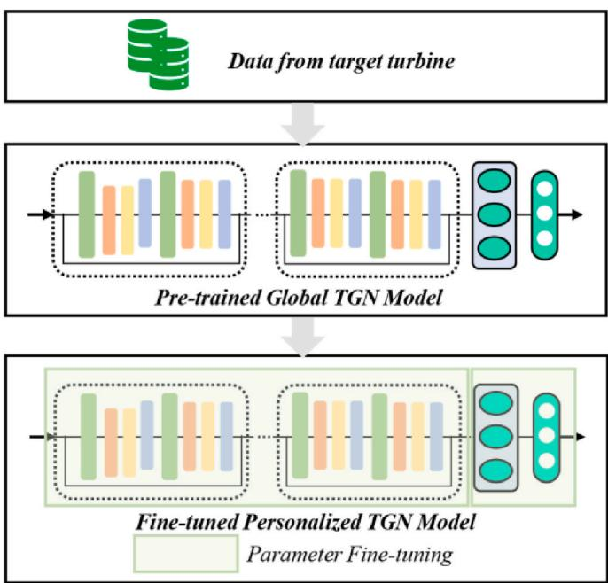  
Fig. 6. The proposed personalized transfer learning.

# 4.Case study

In this study, a series of experimental investigations are designed to evaluate the proposed two-stage forecasting framework. The experimental details and corresponding discussions are presented, including dataset description, evaluation metrics, ablation studies, model architectures, privacy preservation, knowledge transfer, and advantage

Table 3 Comprehensive details concerning the used data.   

<table><tr><td>Wind turbine</td><td>Data source</td><td>Cover range</td><td>Recording interval</td></tr><tr><td>WT1</td><td>DSWE-Wind Farm Dataset1</td><td>2009/1/22009/ 4/1</td><td>10-min-interval</td></tr><tr><td>WT2</td><td>DSWE-Wind Farm Dataset1</td><td>2009/1/22009/ 4/1</td><td>10-min-interval</td></tr><tr><td>WT3</td><td>DSWE-Wind Farm Dataset2</td><td>2010/5/12010/ 8/1</td><td>10-min-interval</td></tr><tr><td>WT4</td><td>DSWE-Wind Farm Dataset2</td><td>2010/5/12010/ 8/1</td><td>10-min-interval</td></tr><tr><td>WT5</td><td>DSWE-Wind Farm Dataset2</td><td>2010/8/1-2010/ 11/1</td><td>10-min-interval</td></tr><tr><td>WT6</td><td>DSWE-Wind Farm Dataset2</td><td>2010/8/12010/ 11/1</td><td>10-min-interval</td></tr></table>

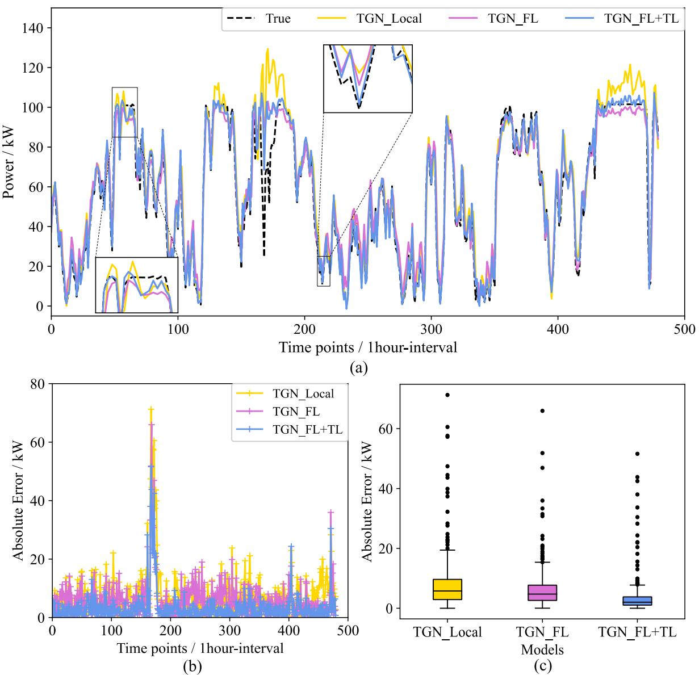  
Fi 7 errors at each time point. (c) Data distribution characteristics of forecasting errors.

# 4.1. Data description

The used datasets, referred to as the Data Science for Wind Energy (DSWE) datasets, are openly accessible online [40]. Both Wind Farm Dataset1 and Wind Farm Dataset2 are recorded at a $1 0 { \cdot } \mathrm { m i n }$ interval. To align with the time granularity commonly encountered in practical engineering applications, operational data is resampled at a 1-h interval, achieved by averaging every six recorded points. After segmenting the data into samples, each sample's input consists of a 24-timepoint window, while the output corresponds to the power generation at the next timepoint. Then, six wind turbines denoted as WT1, WT2, WT3, WT4, WT5, and WT6, originating from different datasets and time periods, are selected to validate the effectiveness of the proposed forecasting framework. Comprehensive details concerning the used data can be found in Table 3. In this study, each turbine takes turns serving as the target turbine, while the remaining turbines function as the source domain for the federated learning-based pre-training process. For every turbine within the source domain, the first fifteen days of data is used in the federated learning stage. In contrast, for the target turbine, the only first ten days is employed to fine-tune the pre-trained global model. The shorter span of data mirrors the scenario of a newly established turbine with limited available data. Besides, the last twenty days of data from target turbines is used as the testing set to validate the forecasting performance.

# 4.2. Evaluation metrics

Three typical metrics are selected to qualify the forecasting performance, including root mean square error (RMSE), mean absolute error (MAE), and R-squared $( \mathbb { R } ^ { 2 } )$ , which can be given by:

$$
\mathrm { M A E } = \frac { 1 } { I } \sum _ { i = 1 } ^ { I } | y _ { i } - \widehat { y } _ { i } |
$$

$$
{ \mathrm { R M S E } } = { \sqrt { { \frac { 1 } { I } } \sum _ { i = 1 } ^ { I } \left( y _ { i } - { \widehat { y } } _ { i } \right) ^ { 2 } } }
$$

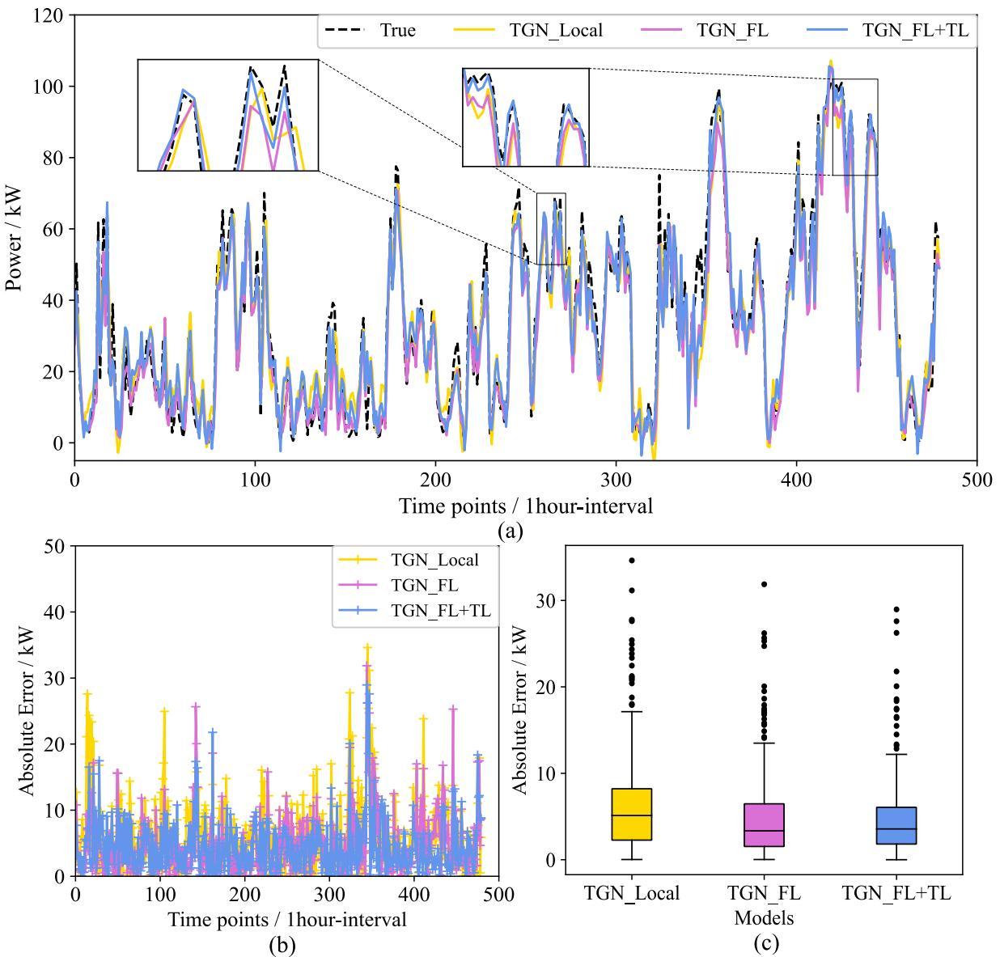  
errors at each time point. (c) Data distribution characteristics of forecasting errors.

$$
\mathbf { R } ^ { 2 } { = } 1 { - } \frac { \displaystyle \sum _ { i = 1 } ^ { I } \left( y _ { i } - \widehat { y } _ { i } \right) ^ { 2 } } { \displaystyle \sum _ { i = 1 } ^ { I } \left( y _ { i } - \overline { { y } } \right) ^ { 2 } }
$$

where $y _ { i }$ and $\widehat { y } _ { i }$ are true value and prediction value at the $i ^ { t h }$ timepoint, respectively. $\bar { y }$ denotes the mean value of true power and $I$ is the number of the forecasted points.

# 4.3. Ablation study

To validate the advantages of federated learning and personalized transfer learning, two benchmark frameworks are designed to form an ablation study. Firstly, a local training framework following the traditional machine learning paradigm, namely TGN_Local, is proposed to validate the knowledge sharing of federated learning. The TGN_Local is trained only using the data held by the target turbine. Each turbine is trained individually and the training process is isolated from other clients. Secondly, a traditional federated learning framework called TGN_FL, is designed to validate the effectiveness of personalized transfer learning. By canceling the definitions of "source domain" and "target domain", TGN_FL treats all turbines (including the target turbine) as local clients and trains a global model for all clients using the federated learning strategy. The training procedure of TGN_FL is the same as in Table 2. The proposed framework incorporating federated learning and transfer learning is called $\mathrm { T G N \_ F L + T L }$ .For the implementation of three frameworks, a PC with an Intel Core i9-10850K CPU $@ 3 . 6 0$ GHz and 32 GB of RAM is employed to work with PyTorch (v.1.7.0). All parameters are optimized using Adam optimizer. The learning rate is initialized at 0.001. The maximum epoch is set at 100 to control the training process. In this study, all experiments are carried out five times and the averaged value and standard deviation are used as final performance metrics.

To objectively compare the performance on different datasets, WT1 and WT3 are selected from Wind Farm Dataset1 and Wind Farm Dataset2, respectively. As shown in Figs. 7 and 8, the results are presented in three sub-figures: sub-figure (a) illustrates the forecasting results for each individual timepoint, sub-figure (b) gives the absolute errors at each timepoint, and sub-figure (c) provides insights into the distribution characteristics of errors through quantiles and the identification of outliers.

Figs. 7 and 8 clearly indicate that the TGN_FL + TL outperforms other framework on the WT1 data and the WT3 data. Specifically, the forecasting error of the TGN_FL $+ \textrm { T L }$ is notably concentrated within a narrower range. Besides, compared with the local training framework (TGN_Local), both TGN_FL and $\mathrm { T G N \ : \mathrm { \ : F L } + \mathrm { T L } }$ exhibit more stable performance in testing data. Taking the WT1 data as an example, there are some periods when the forecasted values deviate from the true values. It can be attributed to the limited scale of training data: TGN_Local is trained only using the limited data stored at the local client, which may result in insufficient information to reliably extract correlations between meteorological factors and power output, particularly in highly fluctuating conditions. For example, TGN_Local exhibits significant errors at time periods that occur sudden changes in power output. In contrast, TGN_FL and TGN_FL $+ \textrm { T L }$ utilize the federated learning mechanism to share knowledge between related turbines, effectively overcoming data shortage.

Table 4 Numerical metrics of the proposed framework and benchmark frameworks on WT1 and WT3.   

<table><tr><td>Wind Turbines</td><td>Data source</td><td>Metrics</td><td>TGN_Local</td><td>TGN_FL</td><td>TGN_FL + TL</td></tr><tr><td>WT1</td><td>DSWE-Wind Farm Dataset1</td><td>RMSE (kW) MAE</td><td>11.0478 ± 0.9544 7.5017 ± 0.5768</td><td>8.6898 ± 0.4311 6.1088 ±</td><td>6.2618 ± 0.3834 3.3306 ±</td></tr><tr><td></td><td></td><td>(kW) R2</td><td>0.8841 ± 0.0183</td><td>0.2499 0.9283 ± 0.0073</td><td>0.0323 0.9627 ± 0.0047</td></tr><tr><td>WT3</td><td>DSWE-Wind Farm Dataset2</td><td>RMSE (kW) MAE (kW)</td><td>8.0954 ± 0.6605 6.1295 ±</td><td>6.6096 ± 0.2606 4.7708 ±</td><td>5.9785 ± 0.2055 4.4392 ±</td></tr></table>

Table 4 presents numerical metrics of the three frameworks, including mean values and standard deviations. Compared with the local training framework, the federated learning framework (TGN_FL)

demonstrates a $2 1 . 3 4 \%$ and $1 8 . 3 5 \%$ decrease in RMSE on the WT1 data and WT3 data, respectively. The proposed framework $( \mathrm { T G N \_ F L } + \mathrm { T L } )$ achieves better results with a $4 3 . 3 2 \%$ and $2 6 . 1 4 \ \%$ reduction in RMSE for these two turbines. Besides, the robustness of three frameworks is reflected in their standard deviations. Taking WT3 data as an example, TGN_Local exhibits larger standard deviations across all numerical metrics, indicating performance instability due to insufficient training data. If training data is limited, model convergence can be disrupted by random initialization. However, by introducing federated learning to address data shortages, both TGN_FL and $\mathrm { T G N \ : \mathrm { \ : F L } + \mathrm { \ : T L } }$ show significantly reduced standard deviations, indicating improved robustness through knowledge-sharing. In comparing TGN_FL and TGN_FL $+ \textrm { T L }$ TGN_FL $+ ~ \mathrm { T L }$ excels in forecasting accuracy and stability due to personalized fine-tuning. Federated learning aims to train a global model for all clients but it may ignore distribution characteristics of specifical target turbines. Personalized fine-tuning, applied independently of the federated learning-based pre-training, ensures that the target turbine has a greater weight during the training process. The finetuning step will pay more attention to the distribution characteristic of the target turbine, enhancing the adaptability of the pre-trained global model to the target turbine. This also explains why TGN_FL $+ \textrm { T L }$ outperforms TGN_FL in the averaged metrics.

# 4.4. Discussion on model architecture

TGN, a forecasting model following series architecture, is the backbone of the proposed forecasting framework. Its performance determines whether temporal dependencies of power data can be captured successfully. Knowledge sharing of federated learning is difficult to obtain satisfactory outcomes if the model's forecasting capability is weak. To verify the effectiveness of the proposed TGN model, the pure TCN model and GRU model are introduced into three kinds of frameworks, including local training framework, federated learning framework, and the proposed framework. Fig. 9 presents numerical metrics of all frameworks in six wind turbines. For the same model architecture, the proposed $\mathrm { F L } + \mathrm { T L }$ framework exhibits better accuracy compared to other two frameworks. The improvements in accuracy can be attributed to several factors. Firstly, the $\mathrm { F L } + \mathrm { T L }$ framework distinguishes between source domain turbines and the target turbine. The source domain turbines are used in the federated learning-based pre-training stage to leverage shared knowledge from related turbines. The federated learning stage addresses insufficient training data while meeting privacy-preserving requirements. Secondly, based on the pre-trained global model, personalized transfer learning can pay more attention to the target turbine, facilitating the adaptation of pre-trained knowledge to specific characteristics of the target turbine. Moreover, the pretrained model provides a starting point for fine-tuning that is closer to convergence than random initialization. Within the same training framework, the proposed TGN model exhibits lower forecasting error than both TCN and GRU models. It indicates that the series architecture is adept at capturing stable temporal correlations: TCN module is responsible for extracting temporal patterns in regional periods through convolutions, then the GRU module is applied to further extract temporal dependencies between different patterns.

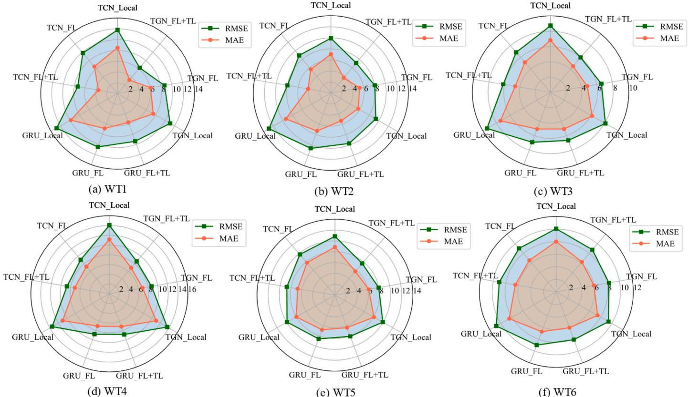  
Fig. 9. The numerical metrics of three frameworks with different forecasting models on six wind turbines.

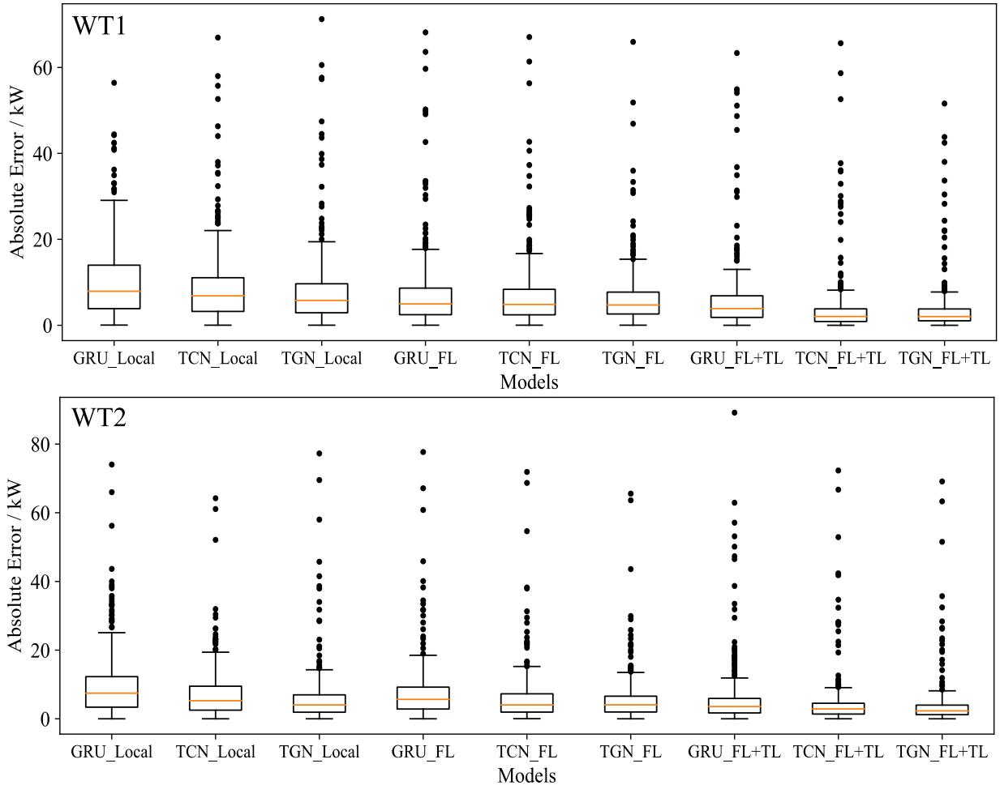  
F 10Theest et r erks wi ent oel  1 n .

For a more intuitive performance comparison, forecasting errors of all turbines from Dataset1 and Dataset2 are listed in Figs. 10 and 11, respectively. The frameworks with the TGN as the backbone have a lower and more concentrated error distribution when three models are integrated into the same framework. Besides, three models (TCN, GRU, and TGN) demonstrate the better performance in the proposed $\mathrm { F L } + \mathrm { T L }$ framework. The comparison validates the generalization of the $\mathrm { F L } + \mathrm { T L }$ framework: it can present significant improvements on different model architectures, even though the forecasting capability of the model is

relatively weak.

Table 5 lists specific numerical metrics of all frameworks employing different model architectures. Based on the same framework, the TGN model outperforms others in terms of accuracy and stability, as evidenced by its lower error and standard deviation. Based on the same model architecture, the $\mathrm { F L } + \mathrm { T L }$ framework reaches the lowest error metrics and standard deviations in most cases, indicating that it can be generalized to different model architectures. This comparison can be explained by knowledge sharing in federated learning and knowledge adaptation in personalized transfer learning. On one hand, knowledge sharing overcomes data shortages in local clients by incorporating data from related turbines, thereby improving forecasting stability. On the other hand, the fine-tuning step in knowledge adaptation prevents the global model from allocating excessive attention to related tasks. Taking the MAE of WT1 as an example, compared with the local training framework, the improvements brought by the $\mathrm { F L } + \mathrm { T L }$ framework on three models (TCN, GRU, and TGN) are $2 6 . 8 1 \% , 3 7 . 5 4 \% ,$ and $4 3 . 3 2 \%$ respectively. Similarly, compared with the traditional federated learning framework, personalized fine-tuning leads to improvements across three models (TCN, GRU, and TGN), with enhancements of 10.66 $\%$ $2 4 . 9 9 \%$ ,and $2 7 . 9 4 \ \%$ , respectively.

The above comparisons not only indicate that the proposed TGN model can achieve better compatibility with the $\mathrm { F L } + \mathrm { T L }$ framework but also prove that the superiorities of the $\mathrm { F L } + \mathrm { T L }$ framework can be expressed in different model architectures.

# 4.5. Discussion on privacy-preserving

The most important motivation of the proposed framework is to address knowledge sharing in privacy-preserving cases. The above three frameworks (Local, FL, $\mathrm { F L } + \mathrm { T L } )$ train models without exchanging raw data, and the $\mathrm { F L } + \mathrm { T L }$ framework makes the best forecasting results while considering data privacy. In this section, the trade-off between privacy protection and forecasting accuracy is discussed by comparing the centralized training framework. The centralized training framework collects raw data of all turbines into the server to train a global model. Data augmentation from related turbines can overcome insufficient training data for the target turbine, but it cannot maintain data privacy. The disclosure of raw data will increase the risk of sensitive information leakage. Taking the TGN model as the backbone, Fig. 12 lists the performance metrics of the centralized training framework and three privacy-preserving training frameworks. The centralized training framework has better forecasting accuracy on most turbines because it can make full use of knowledge from other turbines by learning raw data. However, this training strategy entails gathering raw data from all turbines into a single client, thereby compromising the security of sensitive data. By introducing federated learning and personalized finetuning, the proposed $\mathrm { F L } + \mathrm { T L }$ framework performs best in three frameworks considering privacy protection, even better than the centralized training on some turbines. The advantages can be explained by the introduced personalized fine-tuning step: the centralized training framework assigns the same weights for data from every turbine and aims to establish a model for all turbines. In contrast, the $\mathrm { F L } + \mathrm { T L }$ framework isolates the target turbine from source domain turbines. The personalized fine-tuning only focuses on the expression of shared knowledge in the target turbine, thus ensuring that the target turbine occupies a greater importance during the entire training.

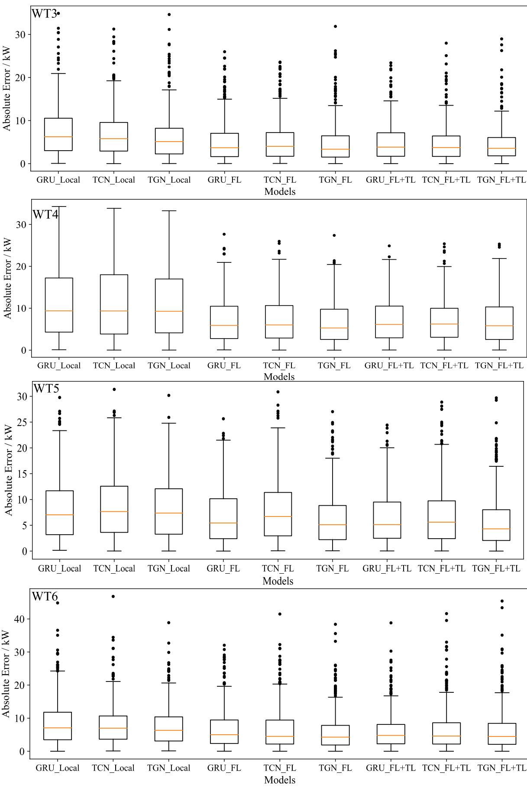  
.

Table 5 Numerical metrics of three frameworks with different models.   

<table><tr><td>Wind Turbines</td><td>Metrics</td><td>GRU_ Local</td><td>TCN_ Local</td><td>TGN Local</td><td>GRU_FL</td><td>TCN_ FL</td><td>TGN_FL</td><td>GRU_ FL + TL</td><td>TCN_ FL + TL</td><td>TGN FL + TL</td></tr><tr><td>WT1</td><td>RMSE(kW)</td><td>12.8309</td><td>11.8016</td><td>11.0478</td><td>10.5113</td><td>9.8271</td><td>8.6898</td><td>9.3905</td><td>7.3706</td><td>6.2618</td></tr><tr><td rowspan="6"></td><td>MAE(kW)</td><td>± 0.4820 9.8397</td><td>± 0.4305 8.5203</td><td>± 0.9544 7.5017</td><td>± 0.2120 6.8780</td><td>± 0.2126 6.5687</td><td>± 0.4311 6.1088</td><td>± 0.1486 5.6711</td><td>± 0.2795 3.5536</td><td>± 0.3834 3.3306</td></tr><tr><td></td><td>± 0.7427</td><td>± 0.4525</td><td>± 0.5768</td><td>± 0.5174</td><td>± 0.2422</td><td>± 0.2499</td><td>± 0.3000</td><td>± 0.2576</td><td>± 0.0323</td></tr><tr><td>R2</td><td>0.8436</td><td>0.8677</td><td>0.8841</td><td>0.8950</td><td>0.9083</td><td>0.9283</td><td>0.9162</td><td>0.9484</td><td>0.9627</td></tr><tr><td></td><td>± 0.0115</td><td>± 0.0093</td><td>± 0.0183</td><td>± 0.0041</td><td>± 0.0038</td><td>± 0.0073</td><td>± 0.0025</td><td>± 0.0040</td><td>± 0.0047</td></tr><tr><td>RMSE(kW)</td><td>12.9089</td><td>9.9347</td><td>9.3786</td><td>10.6442</td><td>8.9054</td><td>8.0552</td><td>9.7005</td><td>7.9724</td><td>7.1211</td></tr><tr><td></td><td>± 0.3874</td><td>± 0.2568</td><td>± 0.5847</td><td>± 0.2265</td><td>± 0.1512</td><td>± 0.2153</td><td>± 0.1988</td><td>± 0.0788</td><td>± 0.0917</td></tr><tr><td rowspan="6"></td><td>MAE(kW)</td><td>9.3872</td><td>7.0343</td><td>5.7066</td><td>7.3096</td><td>5.6341</td><td>5.2806</td><td>5.3702</td><td>4.1917</td><td>3.6103</td></tr><tr><td>$ {}$</td><td>± 0.3651</td><td>± 0.3193</td><td>± 0.4751</td><td>± 0.2736</td><td>± 0.1567</td><td>± 0.0843</td><td>± 0.0658</td><td>± 0.1220</td><td>± 0.1911</td></tr><tr><td></td><td>0.8369</td><td>0.9034 0.9139</td><td>0.8891</td><td>0.9224</td><td></td><td>0.9365</td><td>0.9079</td><td>0.9378</td><td>0.9503</td></tr><tr><td></td><td>± 0.0098</td><td>± 0.0051</td><td>± 0.0113</td><td>± 0.0045</td><td>± 0.0026</td><td>± 0.0034</td><td>± 0.0036</td><td>± 0.0012</td><td>± 0.0012</td></tr><tr><td>RMSE(kW) 9.3932</td><td>8.7373</td><td>8.0954</td><td>6.9117</td><td>6.8585</td><td></td><td>6.6096</td><td>6.6494</td><td>6.1533</td><td>5.9785</td></tr><tr><td>WT3</td><td>± 0.7589</td><td>± 0.4783</td><td>± 0.6605</td><td>± 0.1304</td><td>± 0.2539</td><td>± 0.2606</td><td>± 0.1400</td><td>± 0.2140</td><td></td></tr><tr><td rowspan="6"></td><td>MAE(kW)</td><td>7.4050</td><td>6.8412</td><td>6.1295</td><td>5.0805</td><td>5.1490</td><td>4.7708</td><td>5.0722</td><td></td><td>± 0.2055</td></tr><tr><td></td><td>± 0.7014</td><td>± 0.6299</td><td>± 0.6799</td><td>± 0.1144</td><td>± 0.3088</td><td>± 0.2585</td><td>± 0.0927</td><td>4.6009</td><td>4.4392</td></tr><tr><td></td><td>0.8835</td><td>0.9000</td><td>0.9271</td><td>0.9282</td><td></td><td></td><td></td><td>± 0.2001</td><td>± 0.1438</td></tr><tr><td>0.8654</td><td></td><td></td><td></td><td>± 0.0027</td><td>± 0.0051</td><td>0.9333</td><td>0.9325</td><td>0.9422</td><td>0.9455</td></tr><tr><td>± 0.0233 RMSE(kW)</td><td></td><td>± 0.0134 ± 0.0175</td><td></td><td></td><td></td><td>± 0.0054</td><td>± 0.0027</td><td>± 0.0041</td><td>± 0.0038</td></tr><tr><td>WT4</td><td>13.4578 ± 1.0721</td><td>14.0402 ± 1.6911</td><td>13.6256 ± 0.3493</td><td>8.8199 ± 0.5055</td><td>9.0862 ± 0.5120</td><td>8.7379</td><td>8.8630</td><td>8.7611</td><td>8.6580</td></tr><tr><td rowspan="6">R2</td><td>MAE(kW)</td><td>10.9972</td><td>11.1378</td><td></td><td></td><td></td><td>± 0.4584</td><td>± 0.6086</td><td>± 0.7406</td><td>± 0.2063</td></tr><tr><td></td><td></td><td></td><td>11.0193 7.0453</td><td>7.2756</td><td></td><td>6.8749</td><td>7.1534</td><td>7.1476</td><td>6.9243</td></tr><tr><td>± 0.8327</td><td>± 1.1132</td><td>± 0.3634</td><td>± 0.4511</td><td>± 0.5105</td><td>± 0.3541</td><td></td><td>± 0.5533</td><td>± 0.6478</td><td>± 0.1007</td></tr><tr><td>0.8157</td><td>0.7994</td><td>0.8111</td><td>0.9208</td><td></td><td>0.9160</td><td>0.9223</td><td>0.9200</td><td>0.9219</td><td>0.9237</td></tr><tr><td>± 0.0286</td><td>± 0.0517</td><td>± 0.0094</td><td>± 0.0086</td><td></td><td>± 0.0047</td><td>± 0.0077</td><td>± 0.1034</td><td>± 0.0125</td><td>± 0.0037</td></tr><tr><td>WT5 RMSE(kW)</td><td>10.8483</td><td>9.9407</td><td>8.5711</td><td>9.7885</td><td>7.9886</td><td>8.0792</td><td>8.7651</td><td>7.6266</td><td>9.9270</td></tr><tr><td rowspan="6"></td><td></td><td>± 2.1572</td><td>± 0.3416</td><td>± 0.7793</td><td>± 0.5154</td><td>± 0.3328</td><td>± 0.3655</td><td>± 0.5428</td><td>± 0.3357</td><td>± 0.2264</td></tr><tr><td>MAE(kW)</td><td>8.8692</td><td>8.1022</td><td>6.7887</td><td>7.7973</td><td>6.1729</td><td>6.3718</td><td>6.7944</td><td>5.7079</td><td>8.0020</td></tr><tr><td>± 0.1.8910</td><td>± 0.2875</td><td>± 0.7864</td><td>± 0.3107</td><td>± 0.2924</td><td></td><td>± 0.3519</td><td>± 0.3799</td><td>± 0.3980</td><td>± 0.1953</td></tr><tr><td>0.8915</td><td>0.9089</td><td>0.9323</td><td></td><td>0.9117</td><td>0.9412</td><td>0.9398</td><td>0.9292</td><td>0.9464</td><td></td></tr><tr><td>± 0.0513</td><td>± 0.0064</td><td>± 0.0134</td><td>± 0.0091</td><td>± 0.0050</td><td></td><td>± 0.0056</td><td>± 0.0082</td><td>± 0.0049</td><td>0.9092</td></tr><tr><td>WT6</td><td>RMSE(kW) 10.8084</td><td>10.0592</td><td>9.4212</td><td>8.9873</td><td>9.0511</td><td>8.3357</td><td>8.0632</td><td></td><td></td><td>± 0.0033 8.7624</td></tr><tr><td rowspan="6"></td><td></td><td>± 0.2350</td><td>± 0.8830</td><td>± 0.9126</td><td>± 0.0687</td><td>± 0.0340</td><td>± 0.3821</td><td>± 0.2080</td><td>9.0409 ± 0.1405</td><td>± 0.1415</td></tr><tr><td>MAE(kW)</td><td>8.4895</td><td>8.0120</td><td>7.4515</td><td>6.7147</td><td>6.5636</td><td>5.9616</td><td>6.0409</td><td>6.4984</td><td>6.2277</td></tr><tr><td></td><td>± 0.1920</td><td>± 0.8621</td><td>± 0.9433</td><td>± 0.1055</td><td>± 0.0882</td><td>± 0.4373</td><td>± 0.1951</td><td>± 0.1228</td><td>± 0.1470</td></tr><tr><td>R2</td><td>0.8392</td><td>0.8607</td><td>0.8778</td><td>0.8888</td><td>0.8872</td><td>0.9044</td><td>0.9105</td><td>0.8875</td><td>0.8943</td></tr><tr><td></td><td>± 0.0071</td><td>± 0.0262</td><td>± 0.0256</td><td>± 0.0017</td><td>± 0.0008</td><td>± 0.0091</td><td>± 0.0045</td><td>± 0.0034</td><td>± 0.0034</td></tr></table>

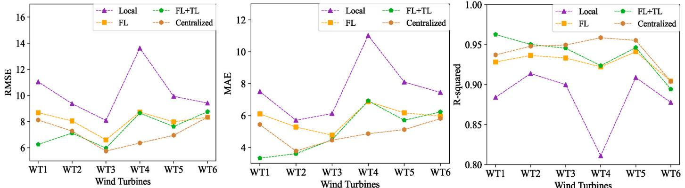  
.

Table 6 Nu  h .   

<table><tr><td>Wind Turbines</td><td>Metrics</td><td>TGN_Local</td><td>TGN_FL</td><td>TGN_FL + TL</td><td>TGN_Centralized</td><td>TGN_Local_S</td></tr><tr><td>WT1</td><td>RMSE(kW)</td><td>11.0478</td><td>8.6898</td><td>6.2618</td><td>8.1290</td><td>6.3651</td></tr><tr><td></td><td></td><td>± 0.9544</td><td>± 0.4311</td><td>± 0.3834</td><td>± 0.3723</td><td>± 0.1656</td></tr><tr><td></td><td>MAE(kW)</td><td>7.5017</td><td>6.1088</td><td>3.3306</td><td>5.4390</td><td>2.9008</td></tr><tr><td></td><td></td><td>± 0.5768</td><td>± 0.2499</td><td>± 0.0323</td><td>± 0.3972</td><td>± 0.1735</td></tr><tr><td></td><td>R{2</td><td>0.8841</td><td>0.9283</td><td>0.9627</td><td>0.9372</td><td>0.9615</td></tr><tr><td></td><td></td><td>± 0.0183</td><td>± 0.0073</td><td>± 0.0047</td><td>± 0.0054</td><td>± 0.0019</td></tr><tr><td>WT2</td><td>RMSE(kW)</td><td>9.3786</td><td>8.0552</td><td>7.1211</td><td>7.2818</td><td>6.3693</td></tr><tr><td></td><td></td><td>± 0.5847</td><td>± 0.2153</td><td>± 0.0917</td><td>± 0.1854</td><td>± 0.1285</td></tr><tr><td></td><td>MAE(kW)</td><td>5.7066</td><td>5.2806</td><td>3.6103</td><td>3.7774</td><td>2.6498</td></tr><tr><td></td><td></td><td>± 0.4751</td><td>± 0.0843</td><td>± 0.1911</td><td>± 0.0542</td><td>± 0.2118</td></tr><tr><td></td><td>R{2</td><td>0.9139</td><td>0.9365</td><td>0.9503</td><td>0.9481</td><td>0.9603</td></tr><tr><td></td><td></td><td>± 0.0113</td><td>± 0.0034</td><td>± 0.0012</td><td>± 0.0026</td><td></td></tr><tr><td>WT3</td><td></td><td>8.0954</td><td>6.6096</td><td>5.9785</td><td>5.7488</td><td>± 0.0015</td></tr><tr><td></td><td>RMSE(kW)</td><td>± 0.6605</td><td>± 0.2606</td><td>± 0.2055</td><td>± 0.2928</td><td>4.9953</td></tr><tr><td></td><td></td><td>6.1295</td><td></td><td></td><td></td><td>± 0.1054</td></tr><tr><td></td><td>MAE(kW)</td><td>± 0.6799</td><td>4.7708</td><td>4.4392 ± 0.1438</td><td>4.4579</td><td>3.5947</td></tr><tr><td></td><td></td><td>0.9000</td><td>± 0.2585 0.9333</td><td></td><td>± 0.3348</td><td>± 0.1333</td></tr><tr><td></td><td>R{2</td><td></td><td></td><td>0.9455</td><td>0.9496</td><td>0.9619</td></tr><tr><td>WT4</td><td></td><td>± 0.0175</td><td>± 0.0054</td><td>± 0.0038</td><td>± 0.0048</td><td>± 0.0015</td></tr><tr><td></td><td>RMSE(kW)</td><td>13.6256</td><td>8.7379</td><td>8.6580</td><td>6.3681</td><td>6.5430</td></tr><tr><td></td><td></td><td>± 0.3493</td><td>± 0.4584</td><td>± 0.2063</td><td>± 0.2627</td><td>± 0.1533</td></tr><tr><td></td><td>MAE(kW)</td><td>11.0193</td><td>6.8749</td><td>6.9243</td><td>4.8639</td><td>5.0200</td></tr><tr><td></td><td></td><td>± 0.3634</td><td>± 0.3541</td><td>± 0.1007</td><td>± 0.2310</td><td>± 0.1555</td></tr><tr><td></td><td>R2</td><td>0.8111</td><td>0.9223</td><td>0.9237</td><td>0.9587</td><td>0.9564</td></tr><tr><td>WT5</td><td></td><td>± 0.0094</td><td>± 0.0077</td><td>± 0.0037</td><td>± 0.0035</td><td>± 0.0021</td></tr><tr><td></td><td>RMSE(kW)</td><td>8.5711</td><td>8.0792</td><td>9.9270</td><td>6.9557</td><td>6.9049</td></tr><tr><td></td><td></td><td>± 0.7793</td><td>± 0.3655</td><td>± 0.2264</td><td>± 0.2189</td><td>± 0.1492</td></tr><tr><td></td><td>MAE(kW)</td><td>6.7887</td><td>6.3718</td><td>8.0020</td><td>5.1216</td><td>5.3620</td></tr><tr><td></td><td></td><td>± 0.7864</td><td>± 0.3519</td><td>± 0.1953</td><td>± 0.3483</td><td>± 0.1303</td></tr><tr><td></td><td>R2</td><td>0.9323</td><td>0.9398</td><td>0.9092</td><td>0.9554</td><td>0.9560</td></tr><tr><td>WT6</td><td></td><td>± 0.0134</td><td>± 0.0056</td><td>± 0.0033</td><td>± 0.0029</td><td>± 0.0019</td></tr><tr><td></td><td>RMSE(kW)</td><td>9.4212</td><td>8.3357</td><td>8.7624</td><td>8.3449</td><td>8.0639</td></tr><tr><td></td><td></td><td>± 0.9126</td><td>± 0.3821</td><td>± 0.1415</td><td>± 0.1540</td><td>± 0.0566</td></tr><tr><td></td><td>MAE(kW)</td><td>7.4515</td><td>5.9616</td><td>6.2277</td><td>5.8120</td><td>5.6477</td></tr><tr><td></td><td></td><td>± 0.9433</td><td>± 0.4373</td><td>± 0.1470</td><td>± 0.1490</td><td>± 0.0924</td></tr><tr><td></td><td>R2</td><td>0.8778</td><td>0.9044</td><td>0.8943</td><td>0.9041</td><td>0.9105</td></tr><tr><td></td><td></td><td>± 0.0256</td><td>± 0.0091</td><td>± 0.0034</td><td>± 0.0034</td><td>± 0.0012</td></tr><tr><td>Privacy Guarantee</td><td></td><td>Yes</td><td>Yes</td><td>Yes</td><td>No</td><td>Yes</td></tr><tr><td>Few-shot Learning</td><td></td><td>Yes</td><td>Yes</td><td>Yes</td><td>Yes</td><td>No</td></tr></table>

Table 6 presents numerical metrics of three privacy-preserving frameworks and centralized training framework. The $\mathrm { F L } + \mathrm { T L }$ framework performs close to or even better than the centralized training framework in accuracy and stability. It should be noted that the most prominent advantage of the $\mathrm { F L } + \mathrm { T L }$ framework lies in its ability to preserve data privacy. Additionally, a local training framework with sufficient data (namely TGN_Local_S) is also listed in Table 6. Taking the WT1 as an example, TGN_Local is trained using ten days of data of the WT1 turbine, whereas TGN_Local_S is trained using sixty days of data of the WT1 turbine. The comparison between TGN_Local and TGN_Local_S indicates that insufficient training data will severely limit forecasting accuracy and stability. Besides, since local data from the same turbine follows same distribution characteristic, the local training framework with sufficient data performs better than the centralized training framework, which combines data from multiple turbines. However, it is worth noting that the high accuracy of TGN_Local_S roots in the abundance operation data, making it is not suitable for few-shot learning cases, such as newly built wind turbines. By introducing related turbines, the centralized training framework reduces the dependence on operation data from the target turbine, but it still faces the potential risk of disclosing sensitive data. In contrast, the proposed $\mathrm { F L } + \mathrm { T L }$ framework not only address the data scarcity in few-shot learning cases but also meets the requirement of privacy-preserving.

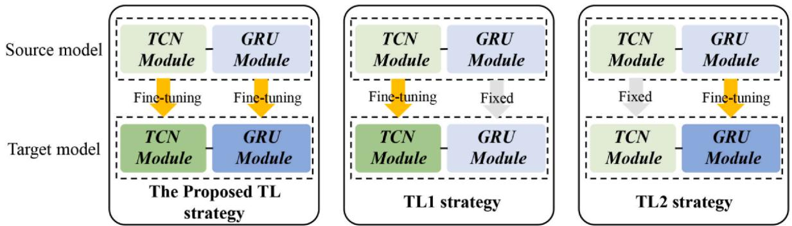  
Fig. 13. The proposed knowledge-transferring strategy and other benchmark strategies.

Table 7 Numerical metrics of the proposed frameworks with different fine-tuning strategies.   

<table><tr><td>Wind Turbines</td><td>Data source</td><td>Metrics</td><td>TGN_FL + TL</td><td>TGN_FL + TL1</td><td>TGN_FL + TL2</td></tr><tr><td>WT1</td><td>DSWE-Wind Farm Dataset1</td><td>RMSE (kW) MAE (kW) R2</td><td>6.2618 ± 0.3834 3.3306 ± 0.0323</td><td>7.5669 ± 0.4139 3.7366 ± 0.1222</td><td>8.5786 ± 0.1120 5.1191 ± 0.1766</td></tr><tr><td>WT3</td><td>DSWE-Wind Farm Dataset2</td><td>RMSE (kW) MAE (kW) R2$</td><td>0.9627 ± 0.0047 5.9785 ± 0.2055 4.4392 ± 0.1438 0.9455 ± 0.0038</td><td>0.9456 ± 0.0056 6.5477 ± 0.0098 5.0602 ± 0.0264 0.9346 ± 0.0002</td><td>0.9301 ± 0.0018 6.0478 ± 0.3522 4.4913 ± 0.3345 0.9442 ±</td></tr></table>

# 4.Discussion on knowledge-transferring

In the proposed two-stage framework, the federated learning-based pre-training is responsible for extracting shared knowledge in the source domain without infringing on data privacy. Personalized transfer learning focuses on transferring source domain knowledge and finetuning the pre-trained global model to adapt the target turbine. Therefore, the knowledge-transferring strategy applied to the fine-tuning stage determines whether personalized adaptation of the source domain model can be successfully achieved on the target turbine. To validate the effectiveness of fine-tuning strategy, two different knowledge-transferring strategies (TL1 and TL2) are designed as comparison objections, as shown in Fig. 13. Specifically, TL1 strategy freezes the pre-trained GRU module and fine-tunes the pre-trained TCN module. TL2 only fine-tunes the pre-trained GRU module while freezing the other module. Based on the global model from the pre-training stage, performance metrics of three fine-tuning strategies on WT1 and WT3 are compared in Table 7 and Fig. 14. The proposed transfer learning strategy that fine-tunes two modules simultaneously reaches the best knowledgetransferring effect. The reason why it improves the pre-trained global model better is that there is a significant coupling relationship between extracting temporal patterns and capturing time dependencies of temporal patterns, so updating both two modules can drive the pre-trained global model to adapt to the target turbine stably.

# 4.7. Discussion on time consumption

Table 8 compares time consumptions of three frameworks based on the TGN model architecture. Since one of the advantages of federated learning is parallel training, time consumption of the federated learning framework comprises training duration on a local client and communication time between the client and the central server. Each training epoch of the TGN_Local consumes 0.3369 s while the TGN_FL consumes

0.3711 s. For the TGN_FL, 0.3573 s are used for the local training in federated learning, and 0.0138 s are responsible for transmitting gradient information between the central server and local clients. Compared with the TGN_FL, the $\mathrm { T G N \ : \mathrm { \ : F L } + \mathrm { T L } }$ exhibits faster training and communication speed in the federated learning stage because of less participating clients. Subsequently, based on the pre-trained global model, time consumption of the fine-tuning stage amounts to 0.2217 s. Notably, the fine-tuning step has a faster training speed than the TGN_Local $( 0 . 2 2 1 7 s < 0 . 3 3 6 9 s$ ), indicating that the pre-trained model provides a higher-quality starting point for expediting model adaptation to the target turbine. In summary, the introduced federated learning leverages related turbines to overcome insufficient data without significantly increasing the time consumption of training. Besides, in each training epoch, the personalized fine-tuning stage only costs 0.2217 s to reach better adaptation to the target turbine.

# 4.8. Advantage analysis

Based on the aforementioned discussions, the advantages of the proposed two-stage framework $( \mathrm { F L } + \mathrm { T L } )$ can be summarized in several aspects:

(1) Privacy-preserving: Comparing with centralized training, applied federated learning effectively addresses security concerns related to sensitive data by keeping raw data locally on each client. During federated learning, the communication between local clients and the central server involves only sharing gradient information of parameters, rather than raw data.

(2) Few-shot learning: The proposed framework aims to tackle insufficient data in few-shot learning cases, such as newly-built wind turbines. The federated learning-based pre-training leverages the knowledge from the source domain turbines to obtain a pre-trained global model. The shared knowledge from related turbines can be regard as an augmentation of available data, whose effectiveness is reflected by the comparison with the TGN Local.

(3) Improved efficiency: The proposed framework exhibits notable improvements in computational efficiency compared to centralized training. Firstly, as one of the distributed learning paradigms, federated learning enables large-scale training by performing parallel computations on multiple local clients, making it suitable for large datasets. Secondly, federated learning only submits gradient updates to the central server instead of raw data. As shown in section 4.7, although the federated learning introduces multiple related turbines into the pre-trained stage, its time consumption is still close to local training framework with insufficient data.

Table 8 Time consumption of three kinds of frameworks.   

<table><tr><td>Frameworks</td><td>Time consumption of each epoch (s)</td></tr><tr><td>TGN_Local</td><td>0.3369</td></tr><tr><td>TGN_FL</td><td>0.3711 (0.3573 + 0.0138)</td></tr><tr><td>TGN_FL + TL</td><td>0.5903 (0.3573 + 0.0113+0.2217)</td></tr></table>

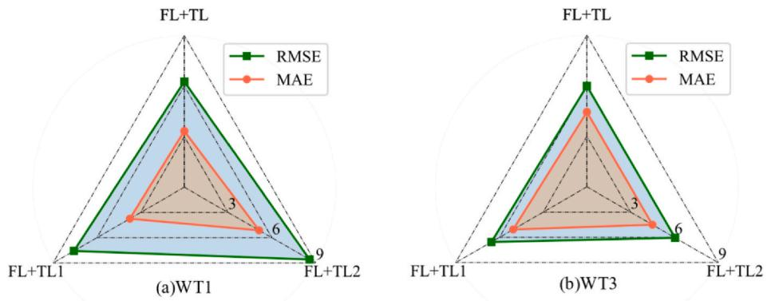  
Fig. 14. The numerical metrics of the proposed frameworks with different fine-tuning strategies.

(4) Personalization: Comparing with traditional federated learning frameworks, the personalized transfer learning isolates the data from target turbines for the fine-tuning stage. The fine-tuning process further directs the pre-trained global model to prioritize the target turbine, facilitating personalized adaptation of shared knowledge.

# 5. Conclusion

To overcome the challenge of insufficient training data in privacypreserving scenarios, a two-stage framework incorporating federated learning and transfer learning is proposed. Firstly, a hybrid model called TGN, which follows a series architecture, is introduced as the backbone structure. Secondly, the framework consists of two stages: federated learning-based pre-training and personalized transfer learning. To ensure data privacy, the federated learning-based pre-training replaces the transmission of raw data with submitting gradient updates. This stage utilizes shared knowledge from the source domain to address data shortage while preserving data privacy. Additionally, its distributed learning paradigm leverages related turbines to address data shortage without significantly increasing the time consumption. The pre-trained model obtained through federated learning is then fine-tuned using personalized transfer learning to obtain a customized model for the target turbine. The personalized fine-tuning addresses the personalized adaptation of shared knowledge. Experimental results demonstrate that the proposed hybrid model and framework achieve superior forecasting accuracy. Compared to local training with insufficient data, the proposed framework exhibits a significant improvement of $4 3 . 3 2 \ \%$ . Furthermore, the introduction of personalized transfer learning leads to a maximum accuracy improvement of $2 7 . 9 4 \%$ compared to traditional federated learning.

However, there are still some limitations that require further investigation. More effective federated learning strategies can be explored to improve few-shot learning in wind power forecasting. Furthermore, combining federated learning with other transfer learning approaches could enhance the personalization of shared knowledge.

# Funding

This research did not receive any specific grant from funding agencies in the public, commercial, or not-for-profit sectors.

# CRediT authorship contribution statement

Yugui Tang: Conceptualization, Methodology, Software, Writing original draft, Writing  review & editing. Shujing Zhang: Data curation, Validation, Formal analysis, Investigation. Zhen Zhang: Data curation, Visualization, Writing  review & editing, Supervision.

# Declaration of competing interest

The authors declare that they have no known competing financial interests or personal relationships that could have appeared to influence the work reported in this paper.

# Data availability

Data will be made available on request.

# Acknowledgements

The authors sincerely thank the experimental data offered by the Texas A&M University.

# References

[1] Yan J, Möhrlen C, Göçmen T, Kelly M, Wessel A, Giebel G. Uncovering wind power chain. Renew Sustain Energy Rev 2022;165:112519.   
[2] Deng X, Shao HJ, Hu CL, Jiang DB, Jiang YT. Wind power forecasting methods based on deep learning: a survey. Cmes-Computer Modeling in Engineering & Sciences 2020;122(1):273301.   
[3] Liu LJ, Liang YJ. Wind power forecast optimization by integration of CFD and Kalman filtering. Energy Sources, Part A Recovery, Util Environ Eff 2021;43(15): 188096.   
[4] Garcia JL, Calderon EC, Avalos GG, Heras ER, Tshikala AM. Forecast of daily output energy of wind turbine using sARIMA and nonlinear autoregressive models. Adv Mech Eng 2019;11(2).   
[5] Huang CJ, Kuo PH. A short-term wind speed forecasting model by using artificial neural networks with stochastic optimization for renewable energy systems. Energies 2018;11(10):2777.   
[ Sun , Lu Y, Li Q, Wang T, Chu F. Short-ter multitep wind power forecasig ba  sptmpoal clations anorme neural etorks. ne Convers Manag 2023;283:116916.   
[7] Li L-L, Liu Z-F, Tseng M-L, Jantarakolica K, Lim MK. Using enhanced crow search algorithm optimization-extreme learning machine model to forecast short-term wind power. Expert Syst Appl 2021;184:115579.   
[8] Higashiyama K, Fujimoto Y, Hayashi Y. Feature extraction of NWP data for wind power forecasting using 3D-convolutional neural networks. Energy Proc 2018;155: 3508.   
[9] Yildiz C, Acikgoz H, Korkmaz D, Budak U. An improved residual-based ol   ho Convers Manag 2021;228:113731.   
[10] Han L, Jing H, Zhang R, Gao Z. Wind power forecast based on improved Long Short Term Memory network. Energy 2019;189:116300.   
[11] Sun Z, Zhao M, Dong Y, Cao X, Sun H. Hybrid model with secondary decomposition, randomforest algorithm, clustering analysis and long short memory network principal computing for short-term wind power forecasting on multiple scales. Energy 2021;221:119848.   
[12] Hu J, Luo Q, Tang J, Heng J, Deng Y. Conformalized temporal convolutional quantile regression networks for wind power interval forecasting. Energy 2022; 248:123497.   
[13] Zhu J, Su L, Li Y. Wind power forecasting based on new hybrid model with TCN residual modification. Energy and AI 2022;10:100199.   
[14] Tian C, Niu T, Wei W. Developing a wind power forecasting system based on deep learning with attention mechanism. Energy 2022;257:124750.   
[15] Cui Y, Chen $\mathrm { Z } ,$ He Y, Xiong X, Li F. An algorithm for forecasting day-ahead wind pr  novel long hort-memory and wid power ram vents. Energy 2023;263:125888.   
[16] Dai X, Liu G-P, Hu W. An online-learning-enabled self-attention-based model for ultra-short-term wind power forecasting. Energy 2023;272:127173.   
[17] Dhiman HS, Deb D, Guerrero JM. On wavelet transform based convolutional neural network and twin support vector regression for wind power ramp event prediction. Sustainable Computing: Informatics and Systems 2022;36:100795.   
[18] Zhang W, Lin Z, Liu X. Short-term offhore wind power forecasting - a hybrid mel based discrete wavelet transfor w), seasonal autoregressive integrated moving average (sarima), and deep-learning-based long short-term memory (LSTM). Renew Energy 2022;185:61128.   
[19] Ahn E, Hur J. A short-term forecasting of wind power outputs using the enhanced wavelet transform and arimax techniques. Renew Energy 2023;212:394402.   
[20] Lu W, Duan J, Wang P, Ma W, Fang S. Short-term wind power forecasting using the hybrid model of improved variational mode decomposition and maximum mixture correntropy long short-term memory neural network. Int J Electr Power Energy Syst 2023;144:108552.   
[21] Duan J, Wang P, Ma W, Tian X, Fang S, Cheng Y, et al. Short-term wind power forecasting using the hybrid model of improved variational mode decomposition and Correntropy Long Short -term memory neural network. Energy 2021;214: 118980.   
[22] Chen Y, Yu S, Islam S, Lim CP, Muyeen SM. Decomposition-based wind power forecasting models and their boundary issue: an in-depth review and comprehensive discussion on potential solutions. Energy Rep 2022;8:880520.   
[23] Zhou Y, Wang J, Lu H, Zhao W. Short-term wind power prediction optimized by multi-objective dragonfly algorithm based on variational mode decomposition. Chaos, Solit Fractals 2022;157:111982.   
[2]Cai Z, Dai S, Ding Q, Zhang J, Xu D, Li Y. Gray wolf optimization-based wind power load mid-long term forecasting algorithm. Comput Electr Eng 2023;109:108769.   
[25] Ewees AA, Al-qaness MAA, Abualigah L, Elaziz MA, Hbo-Lstm. Optimized long short term memory with heap-based optimizer for wind power forecasting. Energy Convers Manag 2022;268:116022.   
[26] Al-Hajj R, Assi A, Neji B, Ghandour R, Al Barakeh Z. Transfer learning for renewable energy systems: a survey. Sustainability 2023;15(11):9131.   
[27] Liu X, Cao Z, Zhang Z. Short-term predictions of multiple wind turbine power outputs based on deep neural networks with transfer learning. Energy 2021;217: 119356.   
[28] Oh J, Park J, Ok C, Ha C, Jun HB. A study on the wind power forecasting model using transfer learning approach. Electronics 2022;11(24):4125.   
[29] Liu Y, Wang J. Transfer learning based multi-layer extreme learning machine for probabilistic wind power forecasting. Appl Energy 2022;312:118729.   
[30] Tang YG, Yang K, Zhang S, Zhang Z. Wind power forecasting: a hybrid forecasting model and multi-task learning-based framework. Energy 2023;278:127864.   
[31] Yang K, Wang Y, Tang Y, Zhang S, Zhang Z. A temporal convolution and gated recurrent unit network with attention for state of charge estimation of lithium-ion batteriese. J Energy Storage 2023;72:108774.   
[32] Tang YG, Yang K, Zhang SJ, Zhang Z. Photovoltaic power forecasting: a hybrid deep learning model incorporating transfer learning strategy. Renewable Sustainable Energy Rev 2022;162:112473.   
[33] Tang L, Xie H, Wang X, Bie Z. Privacy-preserving knowledge sharing for few-shot building energy prediction: a federated learning approach. Appl Energy 2023;337: 120860.   
[34] Li Y, Wang R, Li Y, Zhang M, Long C. Wind power forecasting considering data privacy protection: a federated deep reinforcement learning approach. Appl Energy 2023;329:120291.   
[35] Moradzadeh A, Moayyed H, Mohammadi-Ivatloo B, Vale Z, Ramos C, Ghorbani R. A novel cyber-Resilient solar power forecasting model based on secure federated deep learning and data visualization. Renew Energy 2023;211:697705.   
[36] Moayyed H, Moradzadeh A, Mohammadi-Ivatloo B, Aguiar AP, Ghorbani R. A Cyber-Secure generalized supermodel for wind power forecasting based on deep federated learning and image processing. Energy Convers Manag 2022;267: 115852.   
[37] Wang L, Fan W, Jiang G, Xie P. An efficient federated transfer learning framework for collaborative monitoring of wind turbines in IoE-enabled wind farms. Energy 2023;284:128518.   
[38] Qin D, Liu G, Li Z, Guan W, Zhao S, Wang Y. Federated deep contrastive learning for mid-term natural gas demand forecasting. Appl Energy 2023;347:121503.   
[39] Shang Z, Chen Y, Chen Y, Guo Z, Yang Y. Decomposition-based wind speed forecasting model using causal convolutional network and attention mechanism. Expert Syst Appl 2023;223:119878.   
[40] Y. Ding, Data Science for Wind Energy. Chapman & Hall/CRC Press, Boca Raton, FL. https://aml.engr.tamu.edu/book-dswe/dswe-datasets.